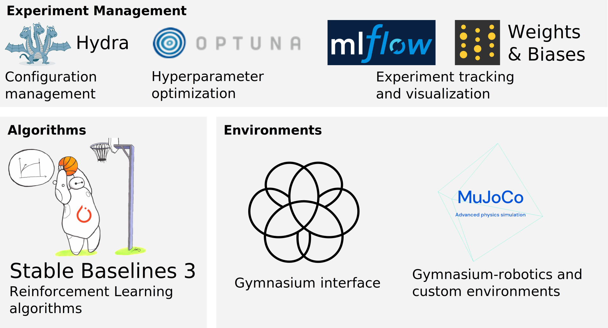

# Scilab-RL

This is the Scilab-RL repository focusing on goal-conditioned reinforcement learning using the [stable baselines 3](https://stable-baselines3.readthedocs.io/en/master/) methods and [Gymnasium](https://gymnasium.farama.org/) interface.
> We now have a wiki with many tutorials, [check it out!](https://scilab-rl.github.io/Scilab-RL/)

The framework is tailored towards the rapid prototyping, development and evaluation of new RL algorithms and methods. It has the following unique selling-points compared to others, like spinning up and stable baselines:
* Built-in data visualization for fast and efficient debugging using MLFLow and Weights & Biases.
* Support for many state-of-the-art algorithms via stable baselines 3 and extensible to others. 
* Built-in hyperparameter optimization using Optuna
* Easy development of new robotic simulation and real robot environments based on MuJoCo.
* Smoke and performance testing
* Compatibility between a multitude of state-of-the-art algorithms for quick empirical comparison and evaluation. 
* A focus on goal-conditioned reinforcement learning with hindsight experience replay to avoid environment-specific reward shaping. 

## Table of Contents

- [Requirements](#requirements)
- [Getting Started](#getting-started-using-the-setup-script)
- [Supported Algorithms](#supported-algorithms)
- [Hyperparameter optimization and management](#hyperparameter-optimization-and-management)
- [Known Issues](#known-issues)

## Requirements
The framework is designed to run on Linux, best compatibility with Ubuntu 22. However, it is also reported to run on MacOS and WSL2 (see [this](https://scilab-rl.github.io/Scilab-RL/wiki/Running-on-Windows-with-WSL2.html) tutorial). The preferred Python version is 3.11, but it is likely to run also with less recent versions >= v3.8. A GPU is not required, but it will speed up the training significantly. 

For visualization with matplotlib, it is important to have the GUI-backend tkinter installed (see [this](https://stackoverflow.com/questions/56656777/userwarning-matplotlib-is-currently-using-agg-which-is-a-non-gui-backend-so) for more information).

It is also important to install the following packages, if they are not yet there. On Ubuntu execute the following:

`sudo apt install libosmesa6-dev libgl1-mesa-glx libglfw3 patchelf gcc ffmpeg`

## Getting started using the setup script

1. run `./scripts/setup.sh`. This will automatically install the Conda Python interpreter, along with all required packages. It will also install the robotic simulator MuJoCo.
2. source your ~/.bashrc: `source ~/.bashrc`
3. activate the conda python environment: `conda activate scilabrl`
2. Optional but recommended: Use Weights and Biases (WandB). [Create an account](https://app.wandb.ai/login?signup=true). Run `wandb login` in the console and paste your API key. If you don't want to use WandB, run your experiments with the command line parameter `wandb=0`.
3. Check your installation with `python3 src/main.py n_epochs=1 wandb=0 env=FetchReach-v2`
4. Look at the tutorials in the [wiki](https://scilab-rl.github.io/Scilab-RL/wiki/) for more details.

You can also install all dependencies manually, but we do not recommend this. 

## Supported Algorithms

### Stable Baselines3 (SB3)
We currently support the _Stable Baselines 3_ goal-conditioned off-policy algorithms: DDPG, TD3, SAC and HER.
We also support PPO.

### One-file implementations
We have one-file implementations of SAC (`cleansac`, optionally with HER), PPO (`cleanppo`) and DQN (`cleandqn`).
These are based on the _Stable Baselines 3_ and _CleanRL_ implementations of the algorithms and have
comparable performance. They can be good starting points for trying out new ideas.

## Hyperparameter optimization and management
The framework has a sophisticated hyperparameter management and optimization pipeline, based on 
_Hydra_, _Optuna_, _MLFlow_ and _Weights & Biases_.
The tutorials in the [wiki](https://scilab-rl.github.io/Scilab-RL/wiki/) explain how to use it.

## Known Issues:

- Mujoco may fail due to [this error](https://github.com/openai/mujoco-py/issues/544) when debugging. If it happens with PyCharm, you can unset "Attach to subprocess automatically while debugging" in the Python Debugger Settings (File | Settings | Build, Execution, Deployment | Python Debugger) to avoid this error.

- Pytorch may complain about a CUDA error, throwing something like this: 
`NVIDIA GeForce RTX 3050 Ti Laptop GPU with CUDA capability sm_86 is not compatible with the current PyTorch installation.
The current PyTorch install supports CUDA capabilities sm_37 sm_50 sm_60 sm_70.`
In that case you need to install the latest nightly build according to the configuration tool on the [website](https://pytorch.org/get-started/locally/).
