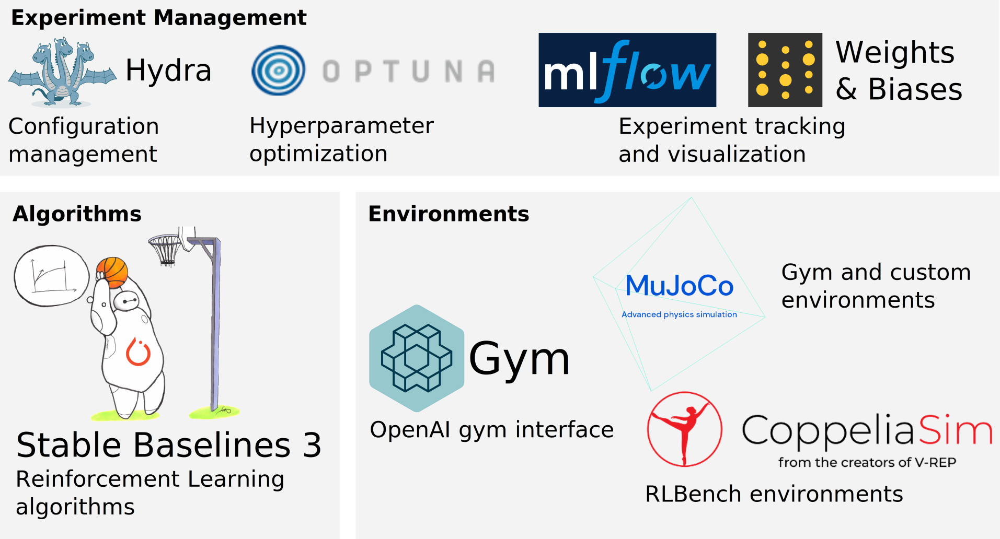

# Scilab-RL

This is the Scilab-RL repository focusing on (hierarchical) goal-conditioned reinforcement learning using the [stable baselines 3](https://stable-baselines3.readthedocs.io/en/master/) methods and [OpenAI gym](https://gym.openai.com/) interface.
> We now have a wiki with many tutorials, [check it out!](https://collaborating.tuhh.de/ckv0173/Scilab-RL/-/wikis/home)



The framework is tailored towards the rapid prototyping and development and evaluation of new RL algorithms and methods. It has the following unique selling-points compared to others, like spinning up and stable baselines:
* Built-in data visualization for fast and efficient debugging using MLFLow and Weights & Biases.
* Support for many state-of-the-art algorithms via stable baselines 3 and extensible to others. 
* Built-in hyperparameter optimization using Optuna
* Easy development of new robotic simulation and real robot environments based on MuJoCo, CoppeliaSim, and PyBullet. 
* Smoke and performance testing
* Compatibility between a multitude of state-of-the-art algorithms for quick empirical comparison and evaluation. 

## Table of Contents

- [Requirements](#requirements)
- [Getting Started](#getting-started)
- [Supported Environments](#supported-environments)
  * [OpenAI Gym / MuJoCo](#installation-instructions-on-mujoco)
  * [CoppeliaSim and RLBench](#installation-instructions-on-coppeliasim-and-rlbench)
- [Supported Algorithms](#supported-algorithms)
  * [Stable Baselines3 (SB3)](#stable-baselines3-(sb3))
- [Hyperparameter optimization and management](#hyperparameter-optimization-and-management)
- [Known Issues](#known-issues)

## Requirements
The framework is designed to run on Linux, best compatibility with Ubuntu 22. However, it is also reported to run on MacOS and WSL2 (see [this](https://collaborating.tuhh.de/ckv0173/Scilab-RL/-/wikis/Running-on-Windows-with-WSL2) tutorial). The preferred Python version is 3.10, but it is likely to run also with less recent versions >= v3.8. A GPU is not required, but it will speed up the training significantly. 

For visualization with matplotlib, it is important to have the GUI-backend tkinter installed (see [this](https://stackoverflow.com/questions/56656777/userwarning-matplotlib-is-currently-using-agg-which-is-a-non-gui-backend-so) for more information).

## Getting Started

### With the setup script

1. run `./setup.sh`
2. Optional but recommended: Use Weights and Biases (WandB). [Create an account](https://app.wandb.ai/login?signup=true). Run `wandb login` in the console and paste your API key. If you don't want to use WandB, run your experiments with `wandb=0`.
3. Check your installation with
   - `python3 main.py n_epochs=1 wandb=0 env=FetchReach-v1` for MuJoCo
   - `python3 main.py n_epochs=1 wandb=0 env=reach_target-state-v0` for RLBench
4. Look at the tutorials in the [wiki](https://collaborating.tuhh.de/ckv0173/Scilab-RL/-/wikis/home).

### Logging and training

1. Install one or both simulators from the [environments section](#supported-environments).

2. Optional but recommended: Use Weights and Biases (WandB). [Create an account](https://app.wandb.ai/login?signup=true). Run `wandb login` in the console and paste your API key. If you don't want to use WandB, run your experiment with `wandb=0`.

3. Check your installation with
   - `python3 main.py n_epochs=1 wandb=0 env=FetchReach-v1` for MuJoCo
   - `python3 main.py n_epochs=1 wandb=0 env=reach_target-state-v0` for RLBench

4. Look at the tutorials in the [wiki](https://collaborating.tuhh.de/ckv0173/Scilab-RL/-/wikis/home).

## Supported Environments
Currently, all goal-conditioned gym environments are supported.
You can use MuJoCo, CoppeliaSim or both. The following sections show you how to install them.

### Installation Instructions on MuJoCo
Currently, _OpenAI Gym_ MuJoCo and Robotics environments and our custom MuJoCo environments are supported. Please see the installation instructions on MuJoCo environments below.

1. Download [MuJoCo version 2.1.0](https://github.com/deepmind/mujoco/releases/tag/2.1.0) 
   Copy the *mujoco210* folder from the downloaded archive
      to folders of your choice (We recommend `/home/USERNAME/`). Note that MuJoCo versions other than 2.1.0 probably do not work. 

1. Set the environment variables in `set_paths.sh` according to the
   locations where you saved the *mujoco210* folder.
   Run `source ./set_paths.sh`
   If you are using an IDE, set the variables there as well.

1. Install python interface. For mujoco 2.1, use `pip install 'mujoco-py==2.1.2.14'`. In case there is an error during compilation, try `sudo apt install libpython3.X-dev` (where `X` is to be replaced with the appropriate version), and `sudo apt-get install libosmesa6-dev`, possibly also `sudo apt-get install patchelf`

1. MuJoCo uses **GLEW** graphics library for rendering with the viewer. When we render an environment using MuJoCo on **Ubuntu**, we get `GLEW initialization error: Missing GL version.` error. To solve this, we need to set the **LD_PRELOAD** environment variable below:

    `export LD_PRELOAD=$LD_PRELOAD:/usr/lib/x86_64-linux-gnu/libGLEW.so`
    
##### Installation Instructions on CoppeliaSim and RLBench
If you'd like to use environments simulated with CoppeliaSim,
[download CoppeliaSim Edu 4.1.0](https://www.coppeliarobotics.com/previousVersions) (4.2.0 causes problems with some environments)
and set the following paths accordingly.
```
COPPELIASIM_ROOT=EDIT/ME/PATH/TO/COPPELIASIM/INSTALL/DIR
LD_LIBRARY_PATH=$LD_LIBRARY_PATH:EDIT/ME/PATH/TO/COPPELIASIM/INSTALL/DIR
QT_QPA_PLATFORM_PLUGIN_PATH=EDIT/ME/PATH/TO/COPPELIASIM/INSTALL/DIR
```
Then `pip install git+https://github.com/stepjam/PyRep.git`. You should now be able to use
CoppeliaSim environments.

If you'd also like to use the [RL Bench](https://github.com/stepjam/RLBench) environments,
`pip install git+https://github.com/stepjam/RLBench.git pyquaternion natsort`.
An example for an RL Bench environment is *reach_target-state-v0*.

## Supported Algorithms

### Stable Baselines3 (SB3)
We currently support the _Stable Baselines 3_ goal-conditioned off-policy algorithms: DDPG, TD3, SAC and HER

## Hyperparameter optimization and management
The framework has a sophisticated hyperparameter management and optimization pipeline, based on Hydra, Optuna, MLFlow and Weights & Biases.
The tutorials in the [wiki](https://collaborating.tuhh.de/ckv0173/Scilab-RL/-/wikis/home) explain how to use it.

## Known Issues:

- Mujoco may fail due to [this error](https://github.com/openai/mujoco-py/issues/544) when debugging. If it happens with PyCharm, you can unset "Attach to subprocess automatically while debugging" in the Python Debugger Settings (File | Settings | Build, Execution, Deployment | Python Debugger) to avoid this error.

- Pytorch may complain about a CUDA error, throwing something like this: 
`NVIDIA GeForce RTX 3050 Ti Laptop GPU with CUDA capability sm_86 is not compatible with the current PyTorch installation.
The current PyTorch install supports CUDA capabilities sm_37 sm_50 sm_60 sm_70.`
In that case you need to install the latest nightly build according to the configuration tool on the [website](https://pytorch.org/get-started/locally/).
