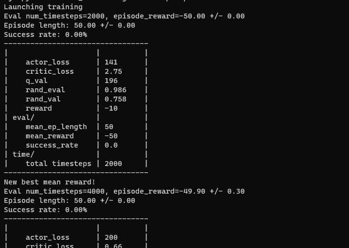
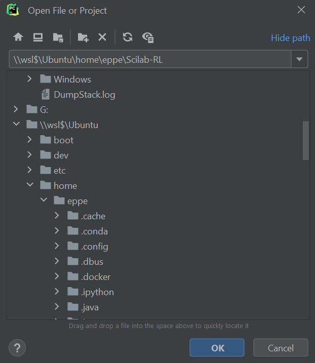
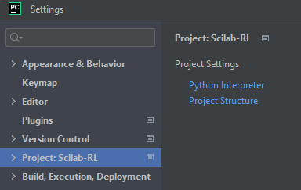
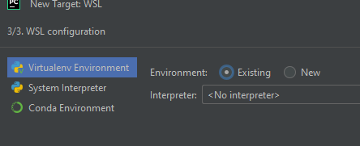
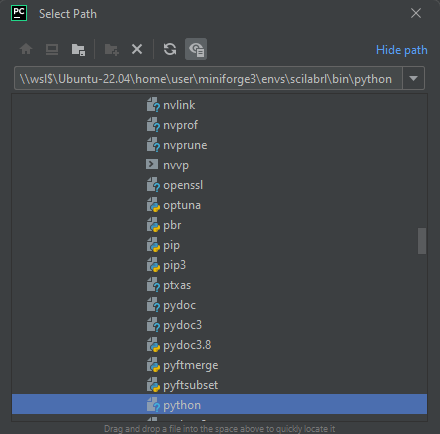
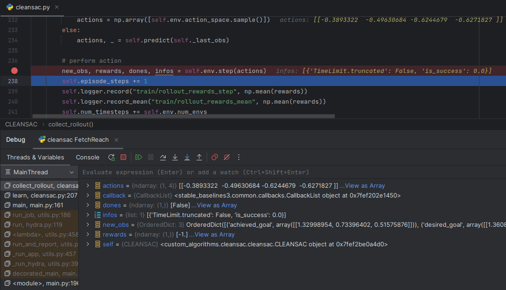

These instructions work for Windows 11, Linux and Mac Systems. The framework should run on most Unix-based systems, but we highly recommend Ubuntu 22. We highly recommend not using a virtual machine. A PC with a dedicated NVIDIA Graphics card is beneficial but not required, the framework also runs on a decent (not too old) laptop. 

# Detailed Instructions

## 1. [Required on Windows systems only] Install Ubuntu 22 LTS via WSL
* Install Ubuntu from the Microsoft Store. Just search for Ubuntu and get Ubuntu 22 LTS. Alternatively, you can install it via Powershell, following these instructions: https://www.c-sharpcorner.com/article/how-to-install-windows-subsystem-for-linux-wsl2-on-windows-11/
* If you have decided to download the Microsoft Store version, you might be required to do the following steps.
    * If you get the error 'The Windows Subsystem for Linux has not been enabled.' while running Ubuntu:
        * Open Control Panel -> Programs and Features -> Turn Windows Feature on or off -> Check Windows Subsystem for Linux -> Restart your machine
    * If you get the error 'Error that requires update of WSL2':
        * Download update from: https://learn.microsoft.com/en-gb/windows/wsl/install-manual#step-4---download-the-linux-kernel-update-package
    * If you get the error 'Error : WslRegisterDistribution failed with error: 0x80370102':
        * Run the following command and restart your pc afterwards: `dism.exe /online /enable-feature /featurename:VirtualMachinePlatform /all /norestart`

* Windows 10 is not recommended.

## 2. Prepare Linux Installation
* [Windows] Start the WSL2 console (E.g. start Ubuntu from the start menu, or open a Powershell and run `wsl`) 
* [Native Ubuntu] Open a terminal window
* Update the apt repository: `sudo apt update`
* Install gcc and other tools: `sudo apt install -y libosmesa6-dev libgl1-mesa-glx libglfw3 patchelf gcc ffmpeg python3-dev python3-pip python3-setuptools libbox2d-dev
`

## 3. Clone this repository 
* Clone this repository by navigating to your home folder in the Ubuntu WSL2 console and running `git clone https://github.com/Scilab-RL/Scilab-RL.git`. This creates a folder `Scilab-RL`.

## 4. Install the main Scilab-RL dependencies
* In the Ubuntu console, navigate to the Scilab-RL folder , e.g., `cd Scilab-RL`. 
* Run `./scripts/setup.sh` to install all required dependencies. 

## 5. Create a Weights & Biases account 
* Go to [wandb.ai](https://wandb.ai) and create an account. If you are affiliated with a research institution or university, you should use that email address to get a free educational account.
* To obtain your API key, go to "settings" in your wandb profile and copy your API key. Then assign it to the system variable 'WANDB_API_KEY'. 
* Add the line 'export WANDB_API_KEY="YOUR KEY" ' to your '~/.bashrc' file. 
## 6. Test the installation from the Linux console
* Activate Conda by running: `source ~/.bashrc`
* Activate Conda environment with: `conda activate scilabrl`
* run: `python src/main.py`
* When running for the first time, MuJoCo is being compiled, and gcc will produce some additional output. 
* Once compilation is finished, you should see console output similar to the following: 

## 7. Accessing visualizations and debugging information. 
* By default, Scilab-RL will store all data of the currently running experiment in the `data` subfolder. The structure is `<Scilab-Rl-root>/data/<git commit hash>/<Environment name>/<Time of Day>`. If the `render_args` variable is set to `record` in the config, you will  also find a subfolder "videos" with renderings of the experiment in this subfolder. 
* To monitor all other training metrics, go to wandb.ai and find your experiment data there. 

## 9. [Optional] Test real-time rendering
* To test the real-time rendering, start `python src/main.py source render=display`. 
* [Windows] You cannot do real-time rendering on Windows and is not recommended.

# Instructions for debugging with PyCharm

## 10. Install Pycharm professional
* As an IDE, we recommend PyCharm professional. On Windows, this is required to work with WSL, on other platforms you may use other IDEs, but we do not recommend this. 
* To install PyCharm professional for free, you need an affiliation with a university or public research institution. Register on the JetBrains website (https://www.jetbrains.com/pycharm/download) with your institution's (e.g. @tuhh.de) email address and request an educational license. On WSL/Windows, you will really need the professional version, so you cannot skip this step. 
* Download Pycharm, install on Windows, and start it. Then you can activate it with your JetBrains login credentials. 

11. Open Scilab-RL in Pycharm
Click on `File-> Open... ` and select the `Scilab-RL` folder in your cloned repository within the WSL file structure. In the directory tree, this is typically indicated with `\\wsl$\Ubuntu` on Windows (see screenshot below) 

12. Setup a PyCharm debug configuration.
* After opening the project, you should see the file structure on the left, and the README.md will be displayed. 
* If you are running this project for the first time the debugger will fail because you need to set up the Python Interpreter and environment variables. For this, please do the following steps.

* Conda Python interpreter setup is as follows: In the Menu click `File--> Settings`, and then `Project: Scilab-RL`

Then click "Python interpreter" and "Add Interpreter--> on WSL"

Now do not select "New", but "Existing":

and navigate to the python binary `\\wsl$\Ubuntu-22.04\home\<user>\miniforge3\envs\scilabrl\bin\python` or the respective path on non-windows systems. 
Note that if you had installed a different version of conda when executing the `scripts/setup.sh` script, the python binary will be in the path of the pre-existing conda installation. For example, if you had Anaconda3 installed before, you should add the path `\\wsl$\Ubuntu-22.04\home\<user>\anaconda3\envs\scilabrl\bin\python`. 

Then click "create" to create the interpreter, and finally "OK". 
* Setup the python paths appropriately. Go to `src/main.py` and double-click on the file. In the upper right of your screen, click on the dropdown box with "main" and select "edit configuration"

[//]: # (Then, add the following Environment variable: )

[//]: # (`LD_LIBRARY_PATH=/home/<user>/.mujoco/mujoco210/bin`)

[//]: # ()
[//]: # (![image]&#40;uploads/c21c912aa1da4b728c226563a33219b5/image.png&#41;)

Then close the debug configuration window.

* For starting a training process, you need to set up a debug configuration. To do so, open `src/main.py`, i.e., double-click on `src/main.py` in the file structure view on the left. Then press in the Menu `Run--> Debug` and then, in the little window that opens, `2 main`. This will auto-create a debug configuration for you, and it will also start the debugger to run the script. 

# General remarks
* You should always use the debugger (the bug symbol) not just the interpreter (the "play" symbol left of the bug.). It is not much slower, and it enables you to use breakpoints and to monitor variables at runtime. These features are critical to your debugging process. 
* To set a breakpoint, just click on any line right of the line number and left of the actual editor window. For example, in these instructions, you started the "cleansac" algorithm. You can now investigate and debug the algorithm, by opening `src/custom_algorithms/cleansac/cleansac.py` and setting a breakpoint, e.g., in line 237, where the action is executed.
* This enables you to directly observe the observations and action values, so you can get an idea what the robot is doing. In this example, we control a robotic gripper with a 4D action space consisting of 3 coordinates to move the gripper towards, plus one value to set the opening of the gripper's fingers. In this case, the action is encoded as a python list of numpy arrays, `[array([ 1.        ,  0.48293757, -1.        , -1.        ])]`. 
You can also observe the variables in the debug window below the code window: 

We strongly recommend to get used to the debugger in this way.
