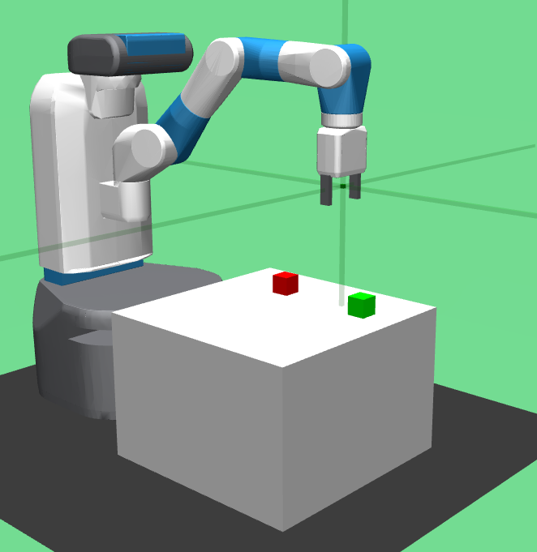
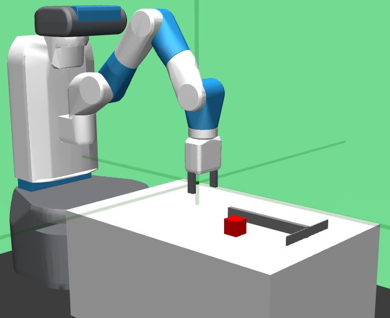
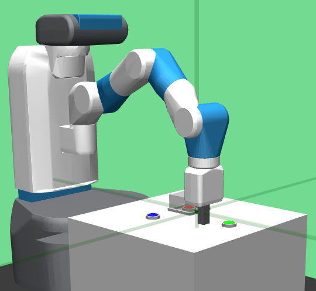

This page gives a short overview over the `custom_envs`.

# MuJoCo Environments

## Robotic Arm Environments
### Blocks

> Blocks-o2-gripper_random-v1

The _blocks_ environment directly inherits from the `gymnasium_robotics.envs.fetch.fetch_env.MujocoFetchEnv`. The basic task is to stack up to 4 blocks on top of each other. The number of blocks is configured with the number after the `o`. There are three configurations for the gripper-goal:
- `gripper_none`: The position of the gripper is not relevant for the goal
- `gripper_random`: The gripper should reach a random position after stacking the blocks
- `gripper_above`: The gripper should be above the stacked blocks

### Hook

> Hook-o1-v1

Basically the same as the _blocks_ environment, but the blocks can be out of reach and have to be pulled closer with a hook. Tool use! The gripper-goal is always `gripper_none`.

### ButtonUnlock

> ButtonUnlock-o2-v1

This time the goal is to push the red button. The robotic arm can only move in the x-y-plane. Before it can push the red button, it has to unlock access to it by pushing up to 2 blue buttons. In the picture, one button was already pressed. Causal Dependencies!

## MyoSuite

MyoSuite provides a collection of musculeoskeletal reinforcement learning tasks.
Originally it uses the deprecated OpenAI `gym` API that we have replaced by the more recent and maintained Gymnasium API.
The reward function is task dependent and comes with a sparse reward and sometimes 3 different dense reward variations.

Collection of environments/tasks (taken from the MyoSuite documentation):

+------------------------+----------------------------------+-----------------+------------------+---------------+---------------------+
|:ref:`tasks`            | **Environment**                  | **Difficulty**  |:ref:`sarcopenia` |:ref:`fatigue` | :ref:`ttransfer`    |
+------------------------+----------------------------------+-----------------+------------------+---------------+---------------------+
| Finger Joint Pose      | ``myoFingerPoseFixed-v0``        | Easy            |         ✓        |      ✓        |                     |
+------------------------+----------------------------------+-----------------+------------------+---------------+---------------------+
| Finger Joint Pose      | ``myoFingerPoseRandom-v0``       | Hard            |         ✓        |      ✓        |                     |
+------------------------+----------------------------------+-----------------+------------------+---------------+---------------------+
| Finger Tip Reach       | ``myoFingerReachFixed-v0``       | Easy            |         ✓        |      ✓        |                     |
+------------------------+----------------------------------+-----------------+------------------+---------------+---------------------+
| Finger Tip Reach       | ``myoFingerReachRandom-v0``      | Hard            |         ✓        |      ✓        |                     |
+------------------------+----------------------------------+-----------------+------------------+---------------+---------------------+
| Elbow Joint Pose       | ``myoElbowPose1D6MRandom-v0``    | Hard            |         ✓        |      ✓        |                     |
+------------------------+----------------------------------+-----------------+------------------+---------------+---------------------+
| Hand Joints Pose       | ``myoHandPoseFixed-v0``          | Easy            |         ✓        |      ✓        |          ✓          |
+------------------------+----------------------------------+-----------------+------------------+---------------+---------------------+
| Hand Joints Pose       | ``myoHandPoseRandom-v0``         | Hard            |         ✓        |      ✓        |          ✓          |
+------------------------+----------------------------------+-----------------+------------------+---------------+---------------------+
| Hand Tips Reach        | ``myoHandReachFixed-v0``         | Easy            |         ✓        |      ✓        |          ✓          |
+------------------------+----------------------------------+-----------------+------------------+---------------+---------------------+
| Hand Tips Reach        | ``myoHandReachRandom-v0``        | Hard            |         ✓        |      ✓        |          ✓          |
+------------------------+----------------------------------+-----------------+------------------+---------------+---------------------+
| Hand Key Turn          | ``myoHandKeyTurnFixed-v0``       | Easy            |         ✓        |      ✓        |          ✓          |
+------------------------+----------------------------------+-----------------+------------------+---------------+---------------------+
| Hand Key Turn          | ``myoHandKeyTurnRandom-v0``      | Hard            |         ✓        |      ✓        |          ✓          |
+------------------------+----------------------------------+-----------------+------------------+---------------+---------------------+
| Hand Object Hold       | ``myoHandObjHoldFixed-v0``       | Easy            |         ✓        |      ✓        |          ✓          |
+------------------------+----------------------------------+-----------------+------------------+---------------+---------------------+
| Hand Object Hold       | ``myoHandObjHoldRandom-v0``      | Hard            |         ✓        |      ✓        |          ✓          |
+------------------------+----------------------------------+-----------------+------------------+---------------+---------------------+
| Hand Pen Twirl         | ``myoHandPenTwirlFixed-v0``      | Easy            |         ✓        |      ✓        |          ✓          |
+------------------------+----------------------------------+-----------------+------------------+---------------+---------------------+
| Hand Pen Twirl         | ``myoHandPenTwirlRandom-v0``     | Hard            |         ✓        |      ✓        |          ✓          |
+------------------------+----------------------------------+-----------------+------------------+---------------+---------------------+
| Die Rotation           | ``myoChallengeDieReorientP1-v1`` | Easy            |         ✓        |      ✓        |          ✓          |
+------------------------+----------------------------------+-----------------+------------------+---------------+---------------------+
| Die Rotation           | ``myoChallengeDieReorientP2-v1`` | Hard            |         ✓        |      ✓        |          ✓          |
+------------------------+----------------------------------+-----------------+------------------+---------------+---------------------+
| Hand Baoding Balls     | ``myoChallengeBaodingP1-v1``     | Easy            |         ✓        |      ✓        |          ✓          |
+------------------------+----------------------------------+-----------------+------------------+---------------+---------------------+
| Hand Baoding Balls     | ``myoChallengeBaodingP2-v1``     | Hard            |         ✓        |      ✓        |          ✓          |
+------------------------+----------------------------------+-----------------+------------------+---------------+---------------------+
| 8 Obj. Rotation        | ``myoHandReorient8-v0``          | Easy            |         ✓        |      ✓        |          ✓          |
+------------------------+----------------------------------+-----------------+------------------+---------------+---------------------+
| 100 Obj. Rotation      | ``myoHandReorient100-v0``        | Easy            |         ✓        |      ✓        |          ✓          |
+------------------------+----------------------------------+-----------------+------------------+---------------+---------------------+
| 1000 Obj. Rotation     | ``myoHandReorientID-v0``         | Hard            |         ✓        |      ✓        |          ✓          |
+------------------------+----------------------------------+-----------------+------------------+---------------+---------------------+
| 1000 Obj. Rotation     | ``myoHandReorientOOD-v0``        | Hard            |         ✓        |      ✓        |          ✓          |
+------------------------+----------------------------------+-----------------+------------------+---------------+---------------------+
| Leg walk               | ``myoLegWalk-v0``                | Easy            |         ✓        |      ✓        |                     |
+------------------------+----------------------------------+-----------------+------------------+---------------+---------------------+
| Leg walk Rough Ground  | ``myoLegRoughTerrainWalk-v0``    | Hard            |         ✓        |      ✓        |                     |
+------------------------+----------------------------------+-----------------+------------------+---------------+---------------------+
| Leg walk Hilly Ground  | ``myoLegHillyTerrainWalk-v0``    | Hard            |         ✓        |      ✓        |                     |
+------------------------+----------------------------------+-----------------+------------------+---------------+---------------------+
| Leg walk Stair Ground  | ``myoLegStairTerrainWalk-v0``    | Hard            |         ✓        |      ✓        |                     |
+------------------------+----------------------------------+-----------------+------------------+---------------+---------------------+
| Grasping & Placing     | ``myoChallengeRelocateP1-v0``    | Easy            |         ✓        |      ✓        |                     |
+------------------------+----------------------------------+-----------------+------------------+---------------+---------------------+
| Chase Tag              | ``myoChallengeChaseTagP1-v0``    | Easy            |         ✓        |      ✓        |                     |
+------------------------+----------------------------------+-----------------+------------------+---------------+---------------------+
