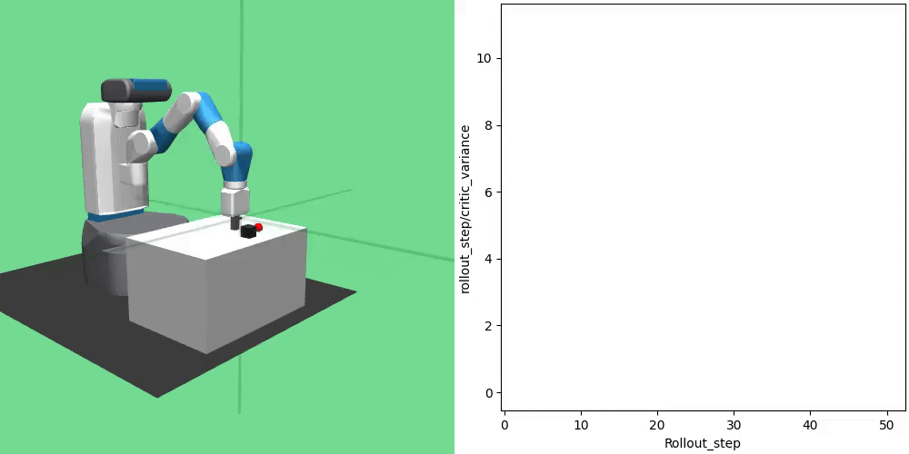

The framework supports the online visualization of user-defined metrics in sync with the rendering provided by the respective environment. Developers can define and visualize any number of online metrics at runtime.

The visualization is controlled via the following options in the `main.yaml` config file (or, respectively, via the command line).

## Rendering Options:

The `render` args specify how and when to render and plot during training and testing. 'record' is for recording the rendered scene as a video file without on-screen display, 'display' for direct visualization, neither one, e.g. 'none' for not rendering at all.

`render_freq` determine the number of epochs after which we render the training/testing.

`render_metrics_*` determine the metric values to render. They have to be provided by the learning algorithm.

`render_frames_per_clip` determine the number of frames per clip when recording. 0 for recording one episode.

### Default `main.yaml` settings:

```
render: 'none' # 'display', 'record', or anything else for neither one
render_freq: 5
render_metrics_train: []
render_metrics_test: []
render_frames_per_clip: 0
```

An example of the side-by-side visualization might look like this, here we highlight a custom critics variance metric and assume it is provided by the algorithm:

`python main.py env='FetchPush-v2' render='display' render_metrics_train=['critic_variance']`

