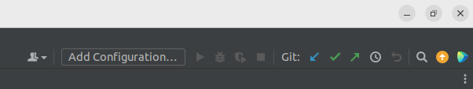

Most of us use Pycharm as the IDE for this project. This page includes some tips and caveats for Pycharm.

> :warning: This tutorial assumes that you have already [set up a virtual environment for the project.](Detailed-Instructions-for-installation-and-getting-started)

# run/debug configuration
Alternatively to starting your experiment from the terminal, you can start it via Pycharm by using a [run/debug configuration](https://www.jetbrains.com/help/pycharm/run-debug-configuration.html). This has the advantages that you can use the Pycharm debugger, that it is easier to switch between multiple configurations and that it is easier to kill your process if something goes wrong.

Creating the run/debug configuration for an experiment-run takes the following steps:
1. Click on `Add Configuration ...` 
2. Add a new Python configuration with the `+` on the top left. 
3. Specify your script path, e.g. `/home/USER/PycharmProjects/Scilab-RL/src/main.py`
> :warning: relative paths and dynamic path creation like `$(whoami)` don't work in the Pycharm run/debug config. You have to use the full paths!
3. Specify your parameters, e.g. `env=Blocks-o1-gripper_random-v1
algorithm=sac`
4. Specify the user environment variables. These are the variables that you set with `./set_paths.sh`. It could look like this:

| Name | Value |
| ------ | ------ |
| MUJOCO_PY_MUJOCO_PATH | /home/USER/mujoco210 |
| LD_LIBRARY_PATH | LD_LIBRARY_PATH:/home/USER/mujoco210/bin |
| HYDRA_FULL_ERROR | 1 |

4. Choose your Python interpreter. It should be the one from your virtual environment.
5. Set your working directory, e.g. `/home/USER/PycharmProjects/Scilab-RL`

If you'd like to create a second, different configuration, you don't have to go through all these steps again. Just copy your configuration (> Edit Configurations... > Copy Configuration (top left)) and change it accordingly.

> :warning:  Mujoco may raise [this error](https://github.com/openai/mujoco-py/issues/544) when debugging. You can unset "Attach to subprocess automatically while debugging" in the Python Debugger Settings (File | Settings | Build, Execution, Deployment | Python Debugger) to avoid this error, or just press `F9` to continue when the error occurs.

# Other tips
- `Ctrl + Shift + F` to search in the whole project or whole directory. 
- `Ctrl + Shift + R` to search-replace in the whole project or whole directory. 
- Select multiple lines. Indent them with `Tab` and unindent them with `Shift + Tab`.
- You can switch between _Project_ (Directories overview) and _Structure_ (Classes and Methods of current file overview) on the left.
- You can use the integrated git functions of Pycharm

Feel free to edit this page and add to this list.
